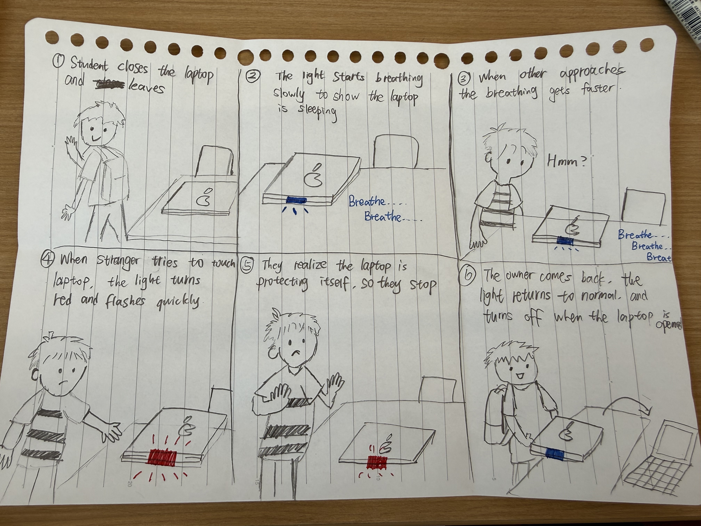
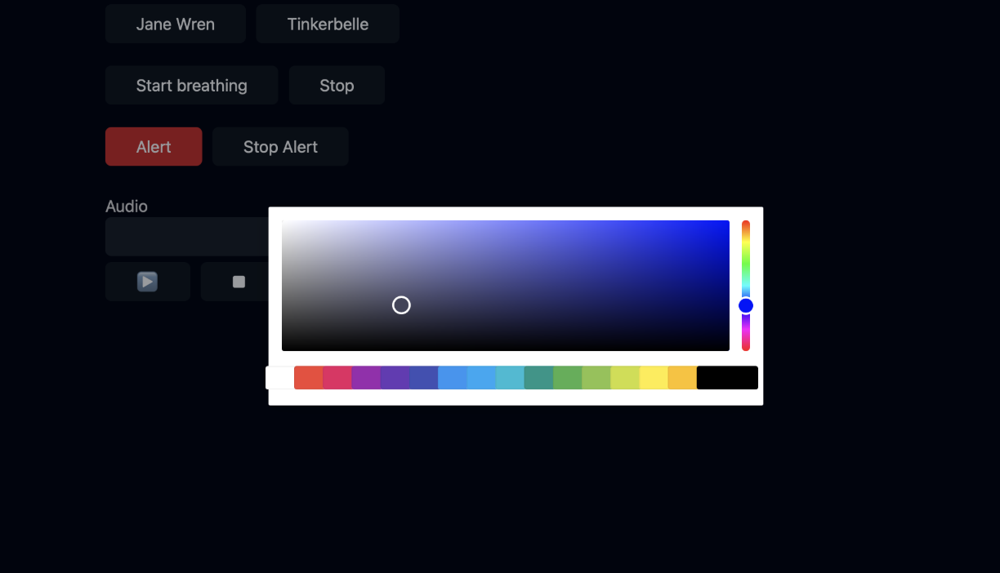

# IDD LAB 1 — The 'Breathing' Sleep Light

**Collaborators: Yuge Xu (yx692), Youzhu Jin (yj578)** 

**Masterwork:** The 'Breathing' Sleep Light (Apple laptops, 2000s)

---

## Part 0. Know Your Master

### User input and feedback from the work
There is no active input from the user. The breathing light is triggered by closing the laptop lid or letting the computer go to sleep. In response, a small white LED on the body of the machine slowly fades in and out on a gentle rhythm, roughly a two to three second cycle.

### Who is present, and the relationship it colors
The relationship here is between a person and a machine. This little light was one of the first design touches to make a cold, silent device feel almost alive. When you glance at that slow, pulsing light, you don't think the computer is off. You think it's sleeping. That small shift changes how close you feel to the machine.

### What the piece is famous for, and its strengths and weaknesses
It is one of the most celebrated details in Apple's industrial design history, often cited as a textbook example of emotional design. Its strength is that this minimal visual language communicates a surprisingly complex piece of information, "I am still alive, just resting," without any words or icons at all. Its weakness is that the feedback is entirely passive and one directional. The user cannot interact with the light itself.

### Describe your masterwork in your own words
Close the lid, and the machine does not disappear. It starts to breathe instead. A single light rises and fades on the rhythm of human sleep, telling you silently that it has not shut down.

---

## Part A. Plan

**Main Scenario:** The student is studying, then leaves to go to the bathroom and closes the laptop. The light changes while the laptop is closed, and the nearby students can see it.

- **Setting:** The interaction happens in the university library while students are studying.
- **Players:** The main user, who is studying with their laptop, and nearby students who are also studying in the library.
- **Activity:** The main user temporarily leaves to go to the bathroom and closes their laptop before leaving. While the laptop is closed, its small "breathing" light keeps blinking and remains visible to nearby students.
- **Goals:** The main user doesn't want to completely shut down their laptop, since they are going to come back in a minute, so they just put it to sleep. Nearby students are focused on their own studying, but may notice the laptop's breathing light and understand that the laptop is still in sleep mode.

### Storyboard 1 — Light simply communicates the laptop's state

1. Student studying, laptop open
2. Student finishes and closes laptop
3. Student walks away
4. Small light starts slowly pulsing
5. Nearby students notice the pulsing light
6. Student comes back and opens laptop

### Storyboard 2 — Someone interacts with the laptop while he's away

1. Student studying
2. Student closes laptop and leaves
3. Another student notices the laptop/light
4. They wonder whether the laptop is asleep and touch/open it
5. Light changes because the laptop is being interacted with
6. Original student comes back

### Storyboard 3 — The light initiates the interaction

1. Student studying
2. Student closes laptop and leaves
3. Nearby student notices the tiny pulsing light
4. They look more closely / point it out to another student
5. They realize the laptop is still active/asleep
6. Original student returns

### Feedback Summary
After reviewing the three storyboards as a team, we found that Storyboard 1 clearly communicated the laptop's sleep state, while Storyboard 2 introduced unnecessary physical interaction. Storyboard 3 best showed both the breathing light and its effect on nearby people, so we selected it as the basis for our prototype.

---

## Part B. Act out the Interaction

We acted out the scene using a flashlight to stand in for the breathing light. One of us played the student who was studying, and the other played a nearby student in the library.

**Were things different in real life than on paper?**
Yes. On paper, we assumed a nearby student would just glance at the light and instantly understand that the laptop was simply asleep. But when we acted it out, this felt too easy. If you don't already know about this design, a stranger's laptop glowing softly in the dark isn't obviously "sleeping." It could just look weird, or make someone curious. So understanding the light isn't as automatic as we first thought.

**Did new ideas come up while acting it out?**
Yes. We realized the light isn't just talking to its owner. Other people nearby are watching it too, and they might read it differently. Some people would recognize it and leave it alone. Others might get curious and want to check it out. We hadn't thought about this difference when we were just planning on paper.

**Where could things go differently?**
We found one key moment where the story could take two different paths, and it happens right after a nearby student notices the glowing light.

In one version, the student gets curious and opens the laptop to see what is going on. The screen suddenly lights up bright. A moment later, the real owner comes back and finds someone else touching their laptop, which feels a little awkward.

In the other version, the student just leans in for a closer look, realizes the light means the laptop is only sleeping, and leaves it alone. Both students quietly return to their own work, and nothing is disrupted.

This is why we ended up with three versions of our storyboard. The first was a simple, straight line story. The second and third each explored one of these two possible outcomes, showing how the same small moment can unfold in very different ways depending on how the observer reacts.

---

## Part C. Prototype the Light

---

## Part D. Wizard the Device

[Wizard setup recording](https://drive.google.com/file/d/1Uhwu_z-rbWRkaqgAyHLR0zJx9suE3YzQ/view?usp=drive_link)

---

## Part F. Record

[Final video sketch](https://drive.google.com/file/d/1PaZeyPPfI2rwBXfLMNF6pYCnSPNnsKAl/view?usp=drive_link)

---
# Part 2 — ReMastering the light
*This describes the second week's work for this lab activity.*

## Prep (before the next lab)

**Groups we kibitzed with:**
- [Group 1](https://github.com/certaindragon3/Interactive-Lab-Hub/tree/Fall2026/Lab%201)
- [Group 2](https://github.com/zijiz/Interactive-Lab-Hub/blob/Fall2026/Lab%201/README.md)
- [Group 3](https://github.com/davidzhanggg/Interactive-Lab-Hub/tree/Fall2026/Lab%201)

**Summary of feedback we received:**

After watching our video, they were able to guess that our masterwork was a laptop's sleep indicator light, mainly because of the slow pulsing rhythm of the light. They also correctly understood the setting: a student in the library stepping away briefly, not shutting down the laptop completely.

They asked whether the light's color or brightness meant anything different from its rhythm, since they noticed the light looked slightly different in a couple of frames. This made us realize we hadn't fully explained that distinction ourselves, and that the light's meaning was communicated mainly through its slow, repeating pulse rather than through color or brightness changes.

Their main suggestion was to make the light's fade slower and more visible, since subtle brightness changes are harder to notice on video than in person.

---

## Remix, Update, or Critique the Master

### Design Direction

For our second iteration, we chose to fix a weakness of the original breathing sleep light. The original design communicates that the laptop is asleep through a slow, gentle pulse, but its feedback is passive and one-directional. It cannot respond when another person approaches or interacts with the laptop.

### Our Update

We added a second breathing-light state. Under normal conditions, the light continues to pulse slowly, representing that the laptop is peacefully asleep. When another person interacts with the laptop, the light changes to red and begins breathing at a faster, more urgent rhythm.

The red color communicates warning, while the faster pulse makes the device appear alert or anxious. This creates a clear contrast between "sleeping normally" and "something requires attention."

### Interaction Sequence

1. The owner closes the laptop and temporarily leaves.
2. The normal breathing light begins pulsing slowly.
3. Another student notices and approaches the laptop.
4. When the student interacts with it, the light turns red and pulses more rapidly.
5. The student understands the warning and leaves the laptop alone.
6. The light returns to its normal breathing state.

### Connection to Feedback

Our peers noted that the original brightness changes were difficult to see clearly in the video. In response, we made the second state more visually distinct by changing both its color and breathing speed.

### Storyboard

### Prototype

We modified Tinkerbelle to create and remotely control the two breathing-light states. One laptop ran the controller interface while a smartphone acted as the light. Both devices were connected to the same Wi-Fi network.

The controller includes a **Start breathing** button for activating the slow blue sleep state and an **Alert** button for activating the faster red warning state. Separate stop buttons allow the wizard to end either effect. During the video sketch, a hidden team member used these controls to change the phone's light in response to the actors' actions.

**Controller Interface:** The computer interface allows the wizard to start the normal blue breathing light, activate the red alert state, or stop either effect.

### Updated Code

[Lab 1/tinkerbelle-remix](https://github.com/Yuge-225/Interactive-Lab-Hub/tree/Fall2026/Lab%201/tinkerbelle-remix)

### Final Video Sketch

[Watch here](https://drive.google.com/file/d/1-QT_Gn574x3zmgG3VFt4bcYFyD7P_slc/view)

### Reflection

Our redesign preserves the original metaphor of the computer as a living, breathing object, but expands its emotional range. The slow light suggests peaceful sleep, while the rapid red light suggests alertness and discomfort. This makes the device more responsive and gives nearby people clearer feedback about how they should behave.

---

*Assignment lineage: this lab merges "Staging Interaction" (Interactive Lab Hub)
with "Recreating the Masters" (Interaction Design Studio, Profs. Scott Minneman &
Wendy Ju). Massive list of interactive light masterworks generated by Claude.ai.*
