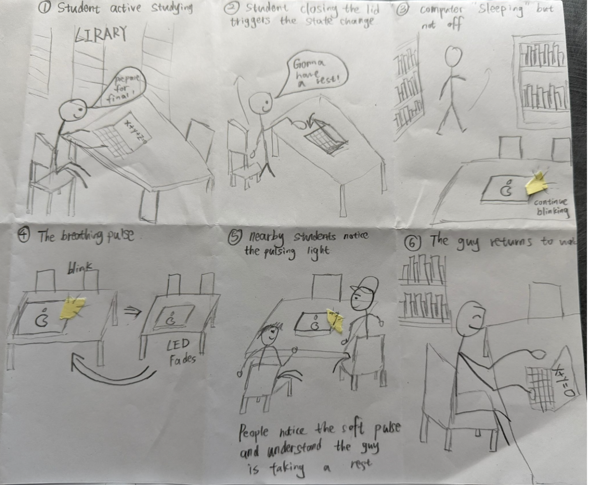
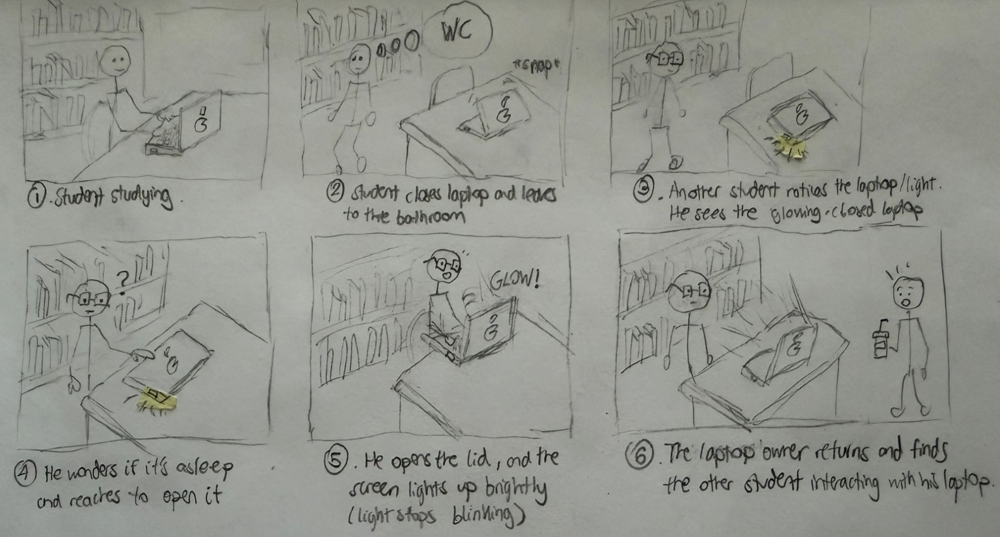
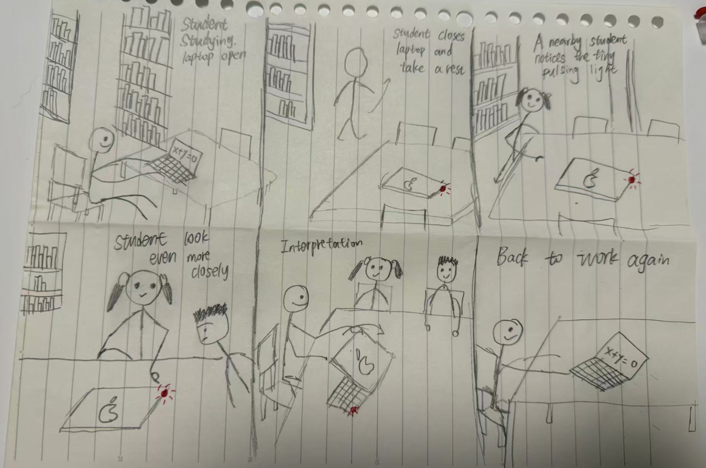
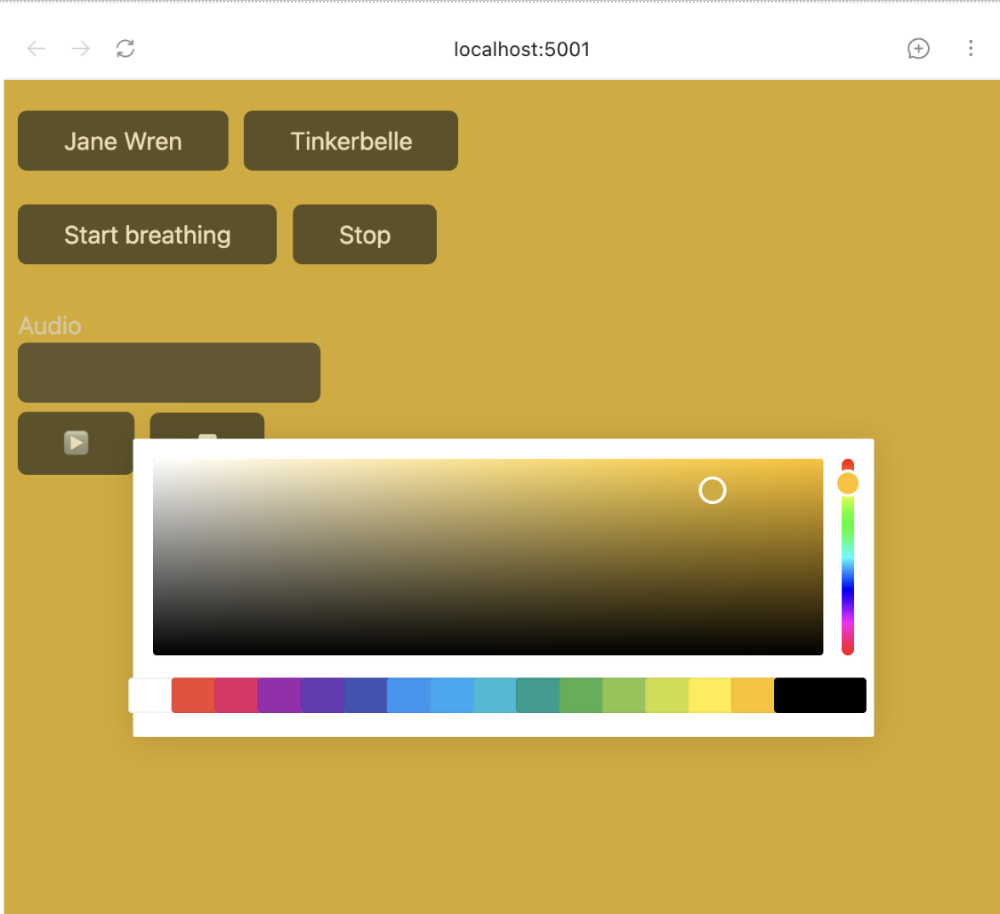

# IDD LAB 1 — The 'Breathing' Sleep Light

**Collaborators: Yuge Xu (yx692), Youzhu Jin (yj578)** 

**Masterwork:** The 'Breathing' Sleep Light (Apple laptops, 2000s)

---

## Part 0. Know Your Master

### User input and feedback from the work
There is no active input from the user. The breathing light is triggered by closing the laptop lid or letting the computer go to sleep. In response, a small white LED on the body of the machine slowly fades in and out on a gentle rhythm, roughly a two to three second cycle.

### Who is present, and the relationship it colors
The relationship here is between a person and a machine. This little light was one of the first design touches to make a cold, silent device feel almost alive. When you glance at that slow, pulsing light, you don't think the computer is off. You think it's sleeping. That small shift changes how close you feel to the machine.

### What the piece is famous for, and its strengths and weaknesses
It is one of the most celebrated details in Apple's industrial design history, often cited as a textbook example of emotional design. Its strength is that this minimal visual language communicates a surprisingly complex piece of information, "I am still alive, just resting," without any words or icons at all. Its weakness is that the feedback is entirely passive and one directional. The user cannot interact with the light itself.

### Describe your masterwork in your own words
Close the lid, and the machine does not disappear. It starts to breathe instead. A single light rises and fades on the rhythm of human sleep, telling you silently that it has not shut down.

---

## Part A. Plan

**Main Scenario:** The student is studying, then leaves to go to the bathroom and closes the laptop. The light changes while the laptop is closed, and the nearby students can see it.

- **Setting:** The interaction happens in the university library while students are studying.
- **Players:** The main user, who is studying with their laptop, and nearby students who are also studying in the library.
- **Activity:** The main user temporarily leaves to go to the bathroom and closes their laptop before leaving. While the laptop is closed, its small "breathing" light keeps blinking and remains visible to nearby students.
- **Goals:** The main user doesn't want to completely shut down their laptop, since they are going to come back in a minute, so they just put it to sleep. Nearby students are focused on their own studying, but may notice the laptop's breathing light and understand that the laptop is still in sleep mode.

### Storyboard 1 — Light simply communicates the laptop's state

1. Student studying, laptop open
2. Student finishes and closes laptop
3. Student walks away
4. Small light starts slowly pulsing
5. Nearby students notice the pulsing light
6. Student comes back and opens laptop

### Storyboard 2 — Someone interacts with the laptop while he's away

1. Student studying
2. Student closes laptop and leaves
3. Another student notices the laptop/light
4. They wonder whether the laptop is asleep and touch/open it
5. Light changes because the laptop is being interacted with
6. Original student comes back

### Storyboard 3 — The light initiates the interaction

1. Student studying
2. Student closes laptop and leaves
3. Nearby student notices the tiny pulsing light
4. They look more closely / point it out to another student
5. They realize the laptop is still active/asleep
6. Original student returns

### Feedback Summary
After reviewing the three storyboards as a team, we found that Storyboard 1 clearly communicated the laptop's sleep state, while Storyboard 2 introduced unnecessary physical interaction. Storyboard 3 best showed both the breathing light and its effect on nearby people, so we selected it as the basis for our prototype.

---

## Part B. Act out the Interaction

We acted out the scene using a flashlight to stand in for the breathing light. One of us played the student who was studying, and the other played a nearby student in the library.

**Were things different in real life than on paper?**
Yes. On paper, we assumed a nearby student would just glance at the light and instantly understand that the laptop was simply asleep. But when we acted it out, this felt too easy. If you don't already know about this design, a stranger's laptop glowing softly in the dark isn't obviously "sleeping." It could just look weird, or make someone curious. So understanding the light isn't as automatic as we first thought.

**Did new ideas come up while acting it out?**
Yes. We realized the light isn't just talking to its owner. Other people nearby are watching it too, and they might read it differently. Some people would recognize it and leave it alone. Others might get curious and want to check it out. We hadn't thought about this difference when we were just planning on paper.

**Where could things go differently?**
We found one key moment where the story could take two different paths, and it happens right after a nearby student notices the glowing light.

In one version, the student gets curious and opens the laptop to see what is going on. The screen suddenly lights up bright. A moment later, the real owner comes back and finds someone else touching their laptop, which feels a little awkward.

In the other version, the student just leans in for a closer look, realizes the light means the laptop is only sleeping, and leaves it alone. Both students quietly return to their own work, and nothing is disrupted.

This is why we ended up with three versions of our storyboard. The first was a simple, straight line story. The second and third each explored one of these two possible outcomes, showing how the same small moment can unfold in very different ways depending on how the observer reacts.

---

## Part C. Prototype the Light

---

## Part D. Wizard the Device

[Wizard setup recording](https://drive.google.com/file/d/1Uhwu_z-rbWRkaqgAyHLR0zJx9suE3YzQ/view?usp=drive_link)

---

## Part F. Record

[Final video sketch](https://drive.google.com/file/d/1PaZeyPPfI2rwBXfLMNF6pYCnSPNnsKAl/view?usp=drive_link)

---

# Part 2 — ReMastering the light

*This describes the second week's work for this lab activity.*

## Prep (before the next lab)

Find three other groups. (How? Maybe Slack?) Visit their Lab Hub pages, watch their
videos, and give them reactions and feedback: tell them what you saw happening,
guess the masterwork and the goals of the characters, and ask about anything that
wasn't clear.

**Who were the other groups you kibitzed with? Add links to their project pages here.**
**Summarize the feedback you got from your partners here.**

## Remix, Update, or Critique the Master

Now that you understand your masterwork from the inside, respond to it. Do the
recreation again, but this time make it your own — pick one of these moves (or
combine them):

1. **Remix the modality.** Your recreation no longer has to (just) use light. Use
   vibration, sound, motion, heat — whatever best carries the interaction. Feel
   free to fork and modify the Tinkerbelle code. (Add your updates to this lab's folder!)
2. **Update it.** Redesign the piece for today's context, or for a setting its
   creators never imagined (the piece with roommates in the room, with children
   present, on a phone, in a car).
3. **Fix its weaknesses.** You identified this master's strengths and weaknesses
   in Part 0 — now address a weakness, or push a strength further.

We will grade this second pass with an emphasis on **creativity** and on how well
your response engages with what your master was really doing.

**Document everything here — especially the storyboard and video. Photos of the
prototype are great too.**

---

*Assignment lineage: this lab merges "Staging Interaction" (Interactive Lab Hub)
with "Recreating the Masters" (Interaction Design Studio, Profs. Scott Minneman &
Wendy Ju). Massive list of interactive light masterworks generated by Claude.ai.*
